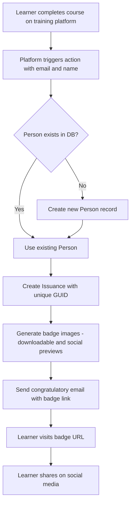
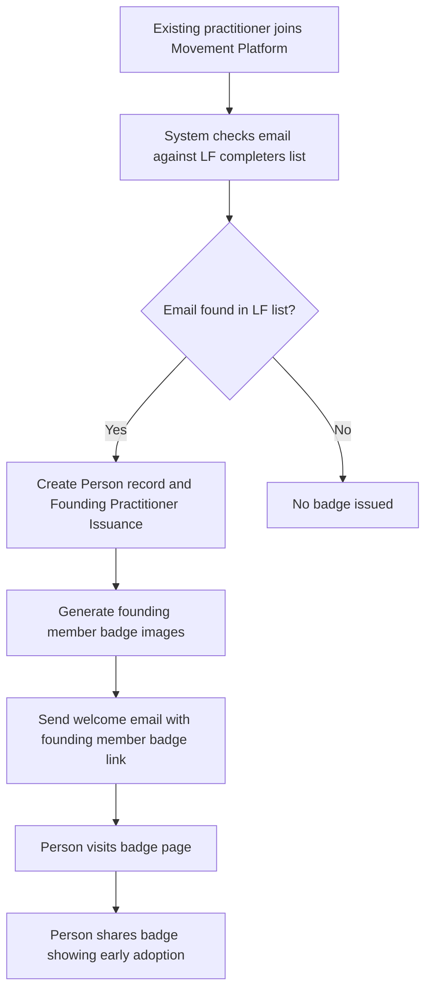
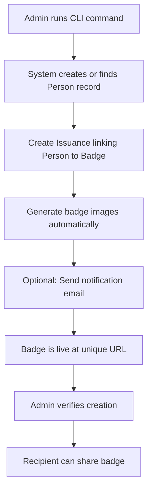

# GSF Badge Platform - Development Specification

## Project Overview

We want to build a badge platform at `badges.greensoftware.foundation` that automatically gives people digital achievement badges when they complete our courses. The main goals are to let people share their achievements on social media and drive traffic back to the GSF Movement Platform.

**Think of it like this:** When someone finishes a course, they get a beautiful digital badge they can share on LinkedIn. When their friends click on it, they see the badge and are encouraged to take the course themselves or join our community.

## How It Works - The Big Picture

### What We're Building
- A website where each person's badge gets its own unique web address (like `badges.greensoftware.foundation/abc123`)
- When people visit that link, they see a professional-looking page showing the achievement
- The page has buttons that encourage visitors to take courses or join our platform
- Everything is optimized to look great when shared on LinkedIn, Twitter, and Facebook

### The Data We Store
We need to keep track of three main things:

1. **Badge Types** - Different kinds of achievements (like "Green Software Practitioner")
2. **People** - Anyone who has earned a badge (just their name and email)
3. **Badge Awards** - Which person earned which badge (each gets a unique ID that becomes the web address)

**Why this structure:** When someone completes a course, we create a connection between that person and the badge type they earned. This connection gets a unique ID that becomes their shareable web address.

## Technical Architecture

### Database Setup (PostgreSQL)
We'll use PostgreSQL database because it can handle lots of users and is reliable. Here's what information we store:

**Badge Types Table:**
```sql
CREATE TABLE badges (
    id UUID PRIMARY KEY DEFAULT gen_random_uuid(),
    name VARCHAR(255) NOT NULL,                    -- "Green Software Practitioner"
    description TEXT,                              -- What the badge represents
    primary_cta_text VARCHAR(100),                 -- "Take This Course"
    primary_cta_url VARCHAR(500),                  -- Where that button links
    secondary_cta_text VARCHAR(100),               -- "Join the Movement"
    secondary_cta_url VARCHAR(500),                -- Where that button links
    badge_template VARCHAR(100),                   -- Which design to use
    created_at TIMESTAMP DEFAULT CURRENT_TIMESTAMP,
    updated_at TIMESTAMP DEFAULT CURRENT_TIMESTAMP
);
```

**People Table:**
```sql
CREATE TABLE people (
    id UUID PRIMARY KEY DEFAULT gen_random_uuid(),
    name VARCHAR(255) NOT NULL,                    -- "Asim Hussain"
    email VARCHAR(255) UNIQUE NOT NULL,            -- "asim@email.com"
    created_at TIMESTAMP DEFAULT CURRENT_TIMESTAMP,
    updated_at TIMESTAMP DEFAULT CURRENT_TIMESTAMP
);
```

**Badge Awards Table:**
```sql
CREATE TABLE issuances (
    id UUID PRIMARY KEY DEFAULT gen_random_uuid(), -- This becomes the URL ID
    person_id UUID REFERENCES people(id),          -- Who earned it
    badge_id UUID REFERENCES badges(id),           -- What they earned
    issued_at TIMESTAMP DEFAULT CURRENT_TIMESTAMP, -- When they earned it
    personalized_description TEXT                  -- Custom message (optional)
);
```

**In Simple Terms:** We have a table of all possible badges, a table of all people, and a table connecting people to their specific badges. Each connection gets a unique ID that becomes the shareable web address.

### System Connections
- **No API needed** - Everything connects directly to the database for speed and simplicity
- **Course Platform** - When someone finishes a course, it writes directly to our database
- **Movement Platform** - Checks the database to automatically give badges to existing practitioners
- **Admin Tools** - Command-line tool and database interface for managing badges

## How People Get Badges - The Three Ways

### Method 1: Finishing a Course
**What happens:**
1. Someone completes a course on our training platform
2. The platform automatically tells our system: "John Smith (john@email.com) just finished the Green Software course"
3. Our system checks if John is already in our database, adds him if he's new
4. Creates a new badge award with a unique ID (like "abc123")
5. Generates beautiful images of the badge
6. Sends John a congratulatory email with his badge link: `badges.greensoftware.foundation/abc123`
7. John visits the link and sees his professional badge page
8. John shares it on LinkedIn, driving traffic back to us



### Method 2: Joining the Movement Platform (Auto-Badge for Existing Practitioners)
**What happens:**
1. Someone who previously completed the Linux Foundation course joins our Movement Platform
2. Our system checks their email against our list of known LF course completers
3. If we find a match, we automatically create a special "Founding Practitioner" badge for them
4. They get a welcome email highlighting their founding member status
5. This makes them feel special and encourages sharing



### Method 3: Manual Creation by Admin
**What happens:**
1. An admin uses our command-line tool to create a badge manually
2. They run a command like: `badge --create "Jane Doe" --email jane@email.com --badge-id 12345`
3. The system creates all the necessary records and images automatically
4. Optionally sends an email to the person
5. The admin can verify it worked with: `badge --list --email jane@email.com`



## The Badge Page - What People See

When someone visits a badge link (like `badges.greensoftware.foundation/abc123`), they see a professional page with:

### Page Elements
- **Header with GSF branding** and navigation to our main sites
- **Large, beautiful badge visual** (like a trophy or medal design)
- **Person's name** and what they achieved
- **Description** of what the badge represents
- **Congratulatory message** that makes them feel good about sharing
- **Two action buttons:**
  - **Primary button** (big and prominent): "Take This Course" 
  - **Secondary button** (smaller): "Join the Movement"
- **Social sharing buttons** for LinkedIn, Twitter, Facebook
- **Download button** to get a high-resolution image
- **Footer** with links back to GSF ecosystem

### Social Media Magic
**The key feature:** When someone shares the badge link on social media, it displays a beautiful preview that makes others want to click. We automatically generate:
- Perfect preview images for each social platform (LinkedIn, Twitter, Facebook)
- Compelling preview text like "John Smith earned Green Software Practitioner Badge"
- Optimized descriptions that encourage clicks

**Why this matters:** When John shares his badge on LinkedIn, his colleagues see an attractive preview that makes them curious. They click, see the badge page, and are encouraged to take the course themselves.

## Admin Tools - How We Manage Everything

### Command-Line Tool (CLI)
For common admin tasks, we'll build a simple command-line tool:

```bash
# Create a badge for someone
badge --create "Asim Hussain" --email jawache@gmail.com --badge-id 12345

# Delete a badge if needed
badge --delete --issuance-id abc123

# See all badges for a person
badge --list --email jawache@gmail.com

# See all available badge types
badge --list-types

# Create badges for many people at once
badge --bulk-create --csv-file users.csv --badge-id 12345
```

**Why CLI:** These commands are fast and perfect for repetitive tasks. An admin can quickly create badges for multiple people or check someone's badge status.

### Database Management Tool
For more complex tasks:
- **PostgreSQL UI tool** for advanced queries and data analysis
- **Bulk operations** that aren't covered by the CLI
- **Data export** capabilities for reporting

### When to Call the Developer
- **Complex troubleshooting** beyond normal admin scope
- **System modifications** and new feature requests
- **Performance issues** or technical problems

## Image Generation - Making Badges Look Professional

### What We Create for Each Badge
1. **High-resolution downloadable image** (PNG/PDF format, perfect for printing or high-quality use)
2. **Social media preview images** optimized for each platform:
   - **LinkedIn:** 1200x627 pixels (their preferred size)
   - **Twitter:** 1200x675 pixels
   - **Facebook:** 1200x630 pixels
   - **Generic fallback:** 1200x630 pixels for other sites

### Design Requirements
- **GSF branding** with our colors and logo
- **Professional appearance** suitable for LinkedIn sharing
- **Badge type-specific designs** (different courses get different badge styles)
- **Personalized with recipient name**
- **Optimized file sizes** so pages load quickly

**Why multiple image sizes:** Each social media platform has different requirements for how preview images display. By creating the right size for each platform, our badges always look perfect when shared.

## Email System - Celebrating Achievements

### What We Send
When someone earns a badge, we send them a congratulatory email that:
- **Celebrates their achievement** with positive, encouraging language
- **Shows their badge link prominently** so they can easily find it
- **Includes sharing instructions** to encourage viral growth
- **Has action buttons** that drive engagement with our platform
- **Uses consistent GSF branding** matching our other communications

### Email Types
- **Course completion email:** "Congratulations on earning your Green Software Practitioner badge!"
- **Founding member email:** "Welcome! Here's your special Founding Practitioner badge"
- **Manual creation email:** Customizable for special circumstances

**Why email matters:** The email is often the first touchpoint after someone earns a badge. Making it celebratory and easy to share increases the likelihood they'll post it on social media.

## Analytics - Measuring Success

### What We Track
- **Badge page views:** How many people visit each badge
- **Button click rates:** Which calls-to-action work best (primary vs secondary)
- **Social sharing activity:** How often people share badges on different platforms
- **Download counts:** How many people download the high-res images
- **Traffic sources:** Where badge viewers come from (LinkedIn, Twitter, etc.)
- **Conversion tracking:** How many badge viewers sign up for courses or join our platform

### Why Analytics Matter
These metrics help us understand:
- **Which badges generate the most engagement**
- **Which social platforms drive the most traffic**
- **How effective our calls-to-action are**
- **Overall ROI of the badge system for growing our community**

## Performance Requirements

### Speed Expectations
- **Badge pages load in under 2 seconds**
- **Images optimized** for fast loading without quality loss
- **Handle 1000+ people viewing badges simultaneously**
- **Email delivery** works reliably even for large batches

### Scalability Planning
As we grow, the system should handle:
- **Thousands of badges** without slowing down
- **High traffic spikes** when popular badges get shared widely
- **Bulk badge creation** for large cohorts of course completers

## Security & Privacy

### Protecting User Data
- **Email addresses never shown publicly** on badge pages
- **Badge URLs use random IDs** that can't be guessed
- **Input validation** prevents malicious data entry
- **Rate limiting** prevents abuse of the system

### Access Control
- **Admin CLI access** restricted to authorized personnel only
- **Database connections** secured with proper authentication
- **Badge authenticity** protected against tampering

## Future Expansion Plans

### LinkedIn Badge Integration (Phase 2)
Eventually, we want to become an official LinkedIn badge issuer, so people can add GSF badges directly to their LinkedIn profiles. We'll build this capability into our existing system:
- **"Add to LinkedIn Profile" button** on badge pages
- **Official LinkedIn credentials platform integration**
- **Backward compatibility** - existing badge links will still work

### Additional Badge Types
The system is designed to support many types of achievements beyond courses:
- **Community contributions:** Recognition for helping others
- **Event participation:** Badges for speakers, attendees
- **Research publications:** Academic contributions
- **Tool implementations:** Using SCI calculators or other GSF tools
- **Leadership roles:** Community champions, working group participants

## Success Metrics

### Traffic Generation Goals
- **High conversion rate** from badge views to platform signups
- **Viral sharing** that brings in new community members
- **Strong referral traffic** from badge links to GSF ecosystem
- **Successful migration** of existing LF practitioners to our platform

### Community Building Impact
- **Active badge recipients** who continue engaging with our platform
- **Word-of-mouth growth** through badge sharing
- **Increased course enrollment** from badge call-to-actions
- **Stronger community identity** through achievement recognition

## Initial Badge Types

### Green Software Practitioner Badge
- **Who gets it:** People who complete the Green Software for Practitioners course
- **Primary button:** "Take This Course" → Links to course enrollment page
- **Secondary button:** "Join the Movement" → Links to Movement Platform signup
- **Description:** "This badge recognizes completion of the Green Software for Practitioners course, demonstrating knowledge of sustainable software development principles and practices."

### Founding Practitioner Badge
- **Who gets it:** Existing LF course completers who join the Movement Platform
- **Primary button:** "Explore the Platform" → Movement Platform dashboard
- **Secondary button:** "View All Courses" → Learning catalog  
- **Description:** "Awarded to early adopters who helped launch the GSF Movement Platform. Founding Practitioners are recognized leaders in the green software community."

## Development Timeline

### Phase 1: Core Platform (Essential Features)
- Set up database and basic badge creation
- Build badge pages with social sharing
- Create image generation system
- Set up email notifications
- Launch CLI admin tool

### Phase 2: Analytics & Optimization (Growth Features)
- Add comprehensive analytics dashboard
- Build advanced admin tools
- Optimize for performance and bulk operations
- Refine based on user feedback

### Phase 3: LinkedIn Integration (Advanced Features)
- Become official LinkedIn badge issuer
- Add "Add to Profile" functionality
- Enhance social features
- Support for specialized badge types

This approach gives us a solid foundation that can grow with our community while immediately providing value through social sharing and traffic generation.